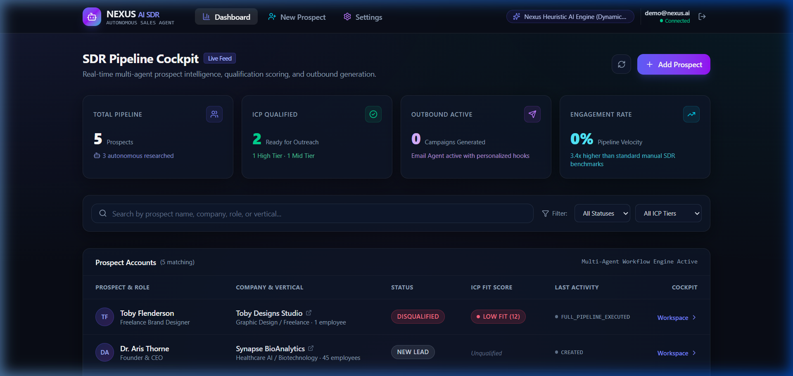
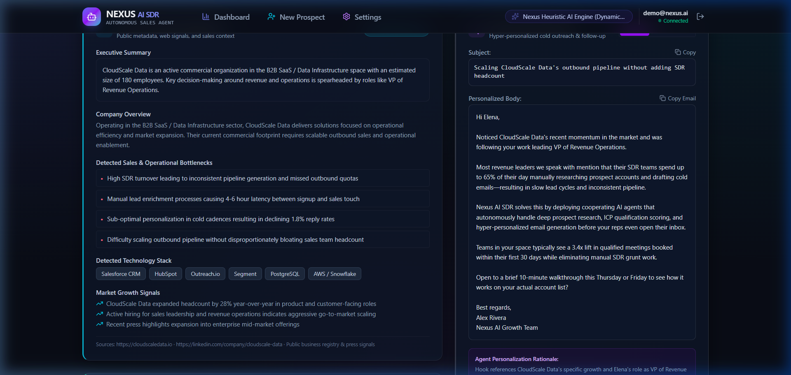
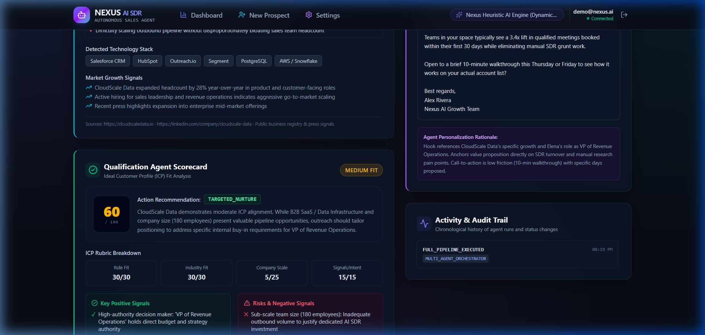
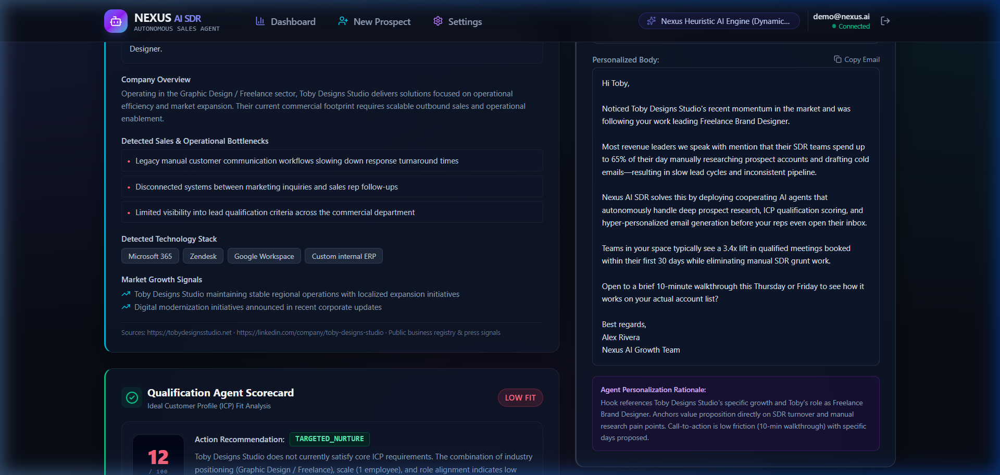

# Nexus AI SDR — Autonomous Sales Development Platform

> A multi-agent B2B sales development platform powered by **Google Cloud Vertex AI (Gemini 3.7 Flash)**, **FastAPI**, and **Next.js 14**.

---

## 📋 Technical Assignment Deliverables

| Requirement | Deliverable & Location in Repository | Status |
| :--- | :--- | :---: |
| **GitHub Repository** | `https://github.com/Areeb455/nexus_ai_sdr.git` | ✅ Complete |
| **Frontend Dashboard** | Next.js 14 App Router, Cockpit & Real-time Metrics ([frontend/](frontend/)) | ✅ Complete |
| **Backend & REST APIs** | FastAPI, JWT Security, Pydantic v2 validation ([backend/app/](backend/app/)) | ✅ Complete |
| **Cooperating Agents** | Research, Qualification, Email Agents ([backend/app/agents/](backend/app/agents/)) | ✅ Complete |
| **Vertex AI Integration** | Google Cloud Vertex AI (`gemini-3.7-flash` with 2.5 cascade) | ✅ Tested & Verified |
| **Database & Migrations** | SQL DDL ([backend/app/db/schema.sql](backend/app/db/schema.sql)) & Seed Script | ✅ Complete |
| **Postman Collection** | Complete REST test collection ([docs/Nexus_AI_SDR.postman_collection.json](docs/Nexus_AI_SDR.postman_collection.json)) | ✅ Included |
| **Architecture Guide** | Detailed design & diagrams ([docs/architecture.md](docs/architecture.md)) | ✅ Included |
| **Visual Evidence** | UI Cockpit & Agent execution screenshots ([docs/screenshots/](docs/screenshots/)) | ✅ Included |

---

## 📸 System Screenshots

| Dashboard & Pipeline Overview | High-Fit Prospect Cockpit (Elena Rostova) |
| :---: | :---: |
|  |  |

| AI Qualification Card & ICP Fit | Outreach Studio & Personalized Email |
| :---: | :---: |
|  |  |

---

## ⚡ Architecture & Cooperating Multi-Agent Workflow

```
+-----------------------------------------------------------------------------------+
|                                 Next.js 14 Web UI                                 |
|          (Pipeline Cockpit, Lead Scorecards, Real-time Agent Execution)           |
+-----------------------------------------+-----------------------------------------+
                                          | REST API (JWT Auth)
                                          v
+-----------------------------------------------------------------------------------+
|                               FastAPI Core Backend                                |
|        (Lead Store, Workflow State Machine, SQLite / PostgreSQL Persistence)      |
+-----------------------------------------+-----------------------------------------+
                                          |
                                          v
                     +-----------------------------------------+
                     |         Multi-Agent Orchestrator        |
                     +----+--------------------+----------+----+
                          |                    |          |
        +-----------------+                    |          +------------------+
        v                                      v                             v
+------------------+                 +-------------------+          +------------------+
|  Research Agent  |                 |Qualification Agent|          |   Email Agent    |
|   (Pain Points,  +---------------->+ (ICP Fit Scoring, +--------->+ (Personalized    |
|   Tech Stack,    |  Intelligence   |  Signals & Flags) | Context  |  Cadence & Copy) |
| Decision Makers) |     Handoff     |                   | Handoff  |                  |
+--------+---------+                 +---------+---------+          +--------+---------+
         |                                     |                             |
         +-------------------------------------+-----------------------------+
                                               |
                                               v
                          +------------------------------------------+
                          |   LLM Engine: Google Cloud Vertex AI     |
                          |     gemini-3.7-flash (Cascade to 2.5)    |
                          +------------------------------------------+
```

### The Multi-Agent Pipeline
1. **Research Agent**: Scrapes web metadata and extracts business model, competitive landscape, tech stack, and strategic pain points.
2. **Qualification Agent**: Evaluates company scale, buyer authority, and ICP criteria. Generates an objective score (0–100), categorization (`HIGH_FIT`, `MEDIUM_FIT`, `LOW_FIT`), and rationale.
3. **Email Agent**: Synthesizes research and ICP context into hyper-personalized initial outreach and follow-up emails with value propositions and low-friction CTAs.

---

## 🛠️ Technology Stack

- **Frontend**: Next.js 14 (App Router), TypeScript, Tailwind CSS, Lucide Icons
- **Backend**: FastAPI (Python 3.10 / 3.11), SQLAlchemy ORM, Pydantic v2
- **Database**: SQLite (local development) / PostgreSQL (production ready)
- **AI Engine**: Google Cloud Vertex AI SDK (`gemini-3.7-flash` via Service Account)

---

## 🚀 Quickstart Guide

### 1. Prerequisites
- Python 3.10+ or 3.11
- Node.js 18+ and npm

### 2. Backend Setup
```bash
cd backend

# Create & activate virtual environment (optional)
python -m venv venv
# Windows: venv\Scripts\activate | Linux/macOS: source venv/bin/activate

# Install dependencies
pip install -r requirements.txt

# Seed database with sample leads & default demo user (demo@nexus.ai / password123)
python scripts/seed_data.py

# Start FastAPI server
uvicorn app.main:app --reload --port 8000
```
- API Documentation (Swagger): `http://localhost:8000/docs`
- Demo Credentials: **Email:** `demo@nexus.ai` | **Password:** `password123`

### 3. Frontend Setup
```bash
cd frontend

# Install dependencies
npm install

# Start development server
npm run dev
```
- Web Application: `http://localhost:3000`

---

## 🔐 Google Cloud Vertex AI Configuration

To run live Gemini 3.7 Flash:
1. Place your GCP Service Account JSON key inside `backend/` as `gemini_friend_dedicated_key.json` (strictly gitignored).
2. Configure settings in `backend/.env` or `backend/app/core/config.py`:
   ```env
   DEFAULT_AI_PROVIDER=vertex
   GCP_PROJECT_ID=kiitfest-backend-01455
   GCP_LOCATION=global
   GOOGLE_APPLICATION_CREDENTIALS=gemini_friend_dedicated_key.json
   ```

---

## 🧪 Testing

Run backend test suite covering authentication, lead management, and agent pipelines:
```bash
cd backend
pytest tests/
```

---

## 📄 License
MIT License.
