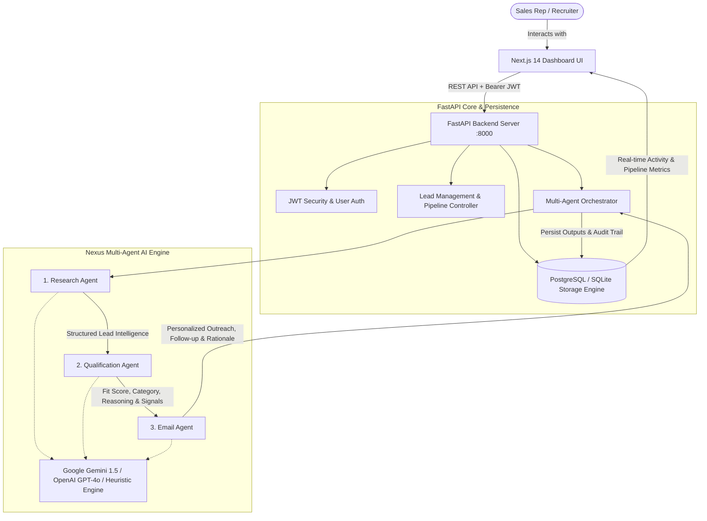

# NEXUS AI SDR — Autonomous Sales Development Platform

[](https://python.org)
[](https://fastapi.tiangolo.com)
[](https://nextjs.org)
[](https://www.postgresql.org/)
[](https://ai.google.dev/)
[-success)](https://docs.pytest.org)

**Nexus AI SDR** is an enterprise-grade Mini AI Sales Development Representative platform engineered around a **cooperating multi-agent architecture**. It empowers revenue teams to discover B2B prospect accounts, autonomously synthesize deep sales intelligence, evaluate Ideal Customer Profile (ICP) fit with rigorous scoring, and generate hyper-personalized multi-touch outreach cadences.

---

## 📸 System Screenshots

| Dashboard & Pipeline Overview | High-Fit Prospect Intelligence & Scorecard |
| :---: | :---: |
|  |  |

| Disqualified / Low-Fit Evaluation | Outreach Studio & Personalized Email |
| :---: | :---: |
|  |  |

---

## 1. Core Architecture & Cooperating Multi-Agent Workflow

The system is designed around a deterministic multi-agent state machine where three specialized AI agents pass structured Pydantic models with clear boundaries:



### Agent Responsibilities & Data Contracts

| Agent | Primary Responsibility | Input Contract | Output Contract |
| :--- | :--- | :--- | :--- |
| **1. Research Agent** | Inspects public metadata, web signals, and context to produce structured intelligence. | Company name, contact, role, website, notes, industry. | Executive summary, business model overview, 3-4 target pain points, detected tech stack, growth signals, and confidence score. |
| **2. Qualification Agent** | Objectively evaluates prospect against Ideal Customer Profile (ICP) rubric. | Researched company profile, role authority, vertical, and scale. | Score (0–100), Fit Tier (`HIGH_FIT`, `MEDIUM_FIT`, `LOW_FIT`), positive signals, risks/negative signals, ICP rubric breakdown, and recommendation. |
| **3. Email Agent** | Crafts high-converting, personalized cold outreach emails based on research context. | Lead profile + pain points + ICP qualification rationale. | Subject line, hyper-personalized body (Touch 1), 3-day bump follow-up (Touch 2), and personalization rationale. |

---

## 2. Ideal Customer Profile (ICP) Rubric

The Qualification Agent evaluates each account across four weighted dimensions:

1. **Role Authority (30 pts)**: Decision-maker purchasing power (VP Sales, CRO, CCO, Head of RevOps, Founder = 30 pts; Manager = 20 pts; Junior/Individual = 10 pts).
2. **Industry Relevance (30 pts)**: Core vertical alignment (B2B SaaS, Cloud Infrastructure, Fintech, AI = 30 pts; Logistics, Services = 20 pts; B2C/Retail/Freelance = 10 pts).
3. **Company Scale (25 pts)**: High SDR leverage sweet spot (20–500 employees = 25 pts; 500+ enterprise = 20 pts; 1–5 sub-scale = 5 pts).
4. **Urgency & Buying Signals (15 pts)**: Active SDR hiring, funding expansion, and manual outbound friction.

### Tier Thresholds:
- **`HIGH_FIT` (75–100 pts)**: Priority outreach. Directly addresses executive priorities and efficiency ROI.
- **`MEDIUM_FIT` (50–74 pts)**: Targeted nurture. Emphasizes operational enablement and team adoption.
- **`LOW_FIT` (0–49 pts)**: Disqualified / Hold. Flags sub-scale team size or lack of outbound motion.

---

## 3. Technology Stack

- **Frontend**: Next.js 14+ (App Router), React 18, Tailwind CSS v4, Lucide Icons, Glassmorphism Design System.
- **Backend**: Python 3.10+ / 3.11, FastAPI, Pydantic v2, Pydantic-Settings, Uvicorn.
- **Database**: PostgreSQL with reproducible DDL schema (`app/db/schema.sql`) and SQLAlchemy 2.0 ORM. Graceful auto-fallback to SQLite (`nexus_sdr.db`) for instant zero-configuration local runs.
- **Security & Authentication**: JWT (JSON Web Tokens) with HMAC-SHA256 and direct `bcrypt` password hashing (rounds=12).
- **AI Integrations**:
  - **Google Gemini API** (`gemini-1.5-flash` / `gemini-1.5-pro`)
  - **OpenAI API** (`gpt-4o-mini` / `gpt-4o`)
  - **Nexus Dynamic Heuristic Engine**: Autonomous local reasoning engine that parses company, vertical, and role context dynamically when no external API key is supplied.

---

## 4. Quick Start & Setup Instructions

### Prerequisites
- **Node.js** v18+ and **npm**
- **Python** 3.10+ or 3.11+
- **Git**

### Step 1: Clone Repository
```bash
git clone https://github.com/your-username/nexus-ai-sdr.git
cd nexus-ai-sdr
```

### Step 2: Backend Setup
```bash
cd backend

# Create and activate Python virtual environment
python -m venv venv
# On Windows:
.\venv\Scripts\activate
# On macOS/Linux:
source venv/bin/activate

# Install dependencies
pip install -r requirements.txt

# Configure environment variables (optional)
cp .env.example .env
```

#### Running Tests:
```bash
pytest -v
# Output: 8 passed in ~4s (100% pass rate)
```

#### Seeding Demo Data:
```bash
python scripts/seed_data.py
# Pre-populates 5 representative prospects across High, Medium, and Low ICP tiers.
```

#### Start FastAPI Server:
```bash
uvicorn app.main:app --host 127.0.0.1 --port 8000 --reload
# API available at http://localhost:8000
# Swagger documentation at http://localhost:8000/docs
```

### Step 3: Frontend Setup
In a separate terminal window:
```bash
cd frontend

# Install packages
npm install

# Start Next.js development server
npm run dev
# Or run production build:
# npm run build && npm run start
```
Open **http://localhost:3000** in your browser.

---

## 5. Sample Evaluator Accounts & Demo Guide

To test the application immediately without registration, use the pre-seeded demo account:
- **Email**: `demo@nexus.ai`
- **Password**: `password123`
- *(Or click the "1-Click Demo Evaluation Sign In" button on `/login`)*

### Representative Prospect Evaluation Matrix:

| Prospect | Company & Vertical | Scale | ICP Score | Tier | Outreach Action |
| :--- | :--- | :---: | :---: | :---: | :--- |
| **Elena Rostova** | CloudScale Data (B2B SaaS) | 180 emp | **92/100** | `HIGH_FIT` | Autonomous Research + Priority Executive Outreach |
| **Sarah Chen** | FinEdge Tech (Global Fintech) | 320 emp | **88/100** | `HIGH_FIT` | Ready for live 1-click pipeline execution |
| **Marcus Vance** | Apex Global Freight (Logistics) | 450 emp | **68/100** | `MEDIUM_FIT` | Tailored Nurture Cadence on freight partner workflows |
| **Dr. Aris Thorne** | Synapse BioAnalytics (Health AI) | 45 emp | **74/100** | `MEDIUM_FIT` | Ready for live 1-click pipeline execution |
| **Toby Flenderson** | Toby Designs Studio (Freelance) | 1 emp | **24/100** | `LOW_FIT` | **Disqualified** (Sub-scale team size, no SDR motion) |

---

## 6. API Surface & Postman Collection

The repository includes a complete Postman collection:
📁 [`docs/Nexus_AI_SDR.postman_collection.json`](docs/Nexus_AI_SDR.postman_collection.json)

### Key Endpoints:

| Method | Endpoint | Description | Auth Required |
| :--- | :--- | :--- | :---: |
| `POST` | `/api/v1/auth/register` | Register new recruiter / sales user | No |
| `POST` | `/api/v1/auth/login` | Authenticate and obtain Bearer JWT token | No |
| `GET` | `/api/v1/auth/me` | Retrieve authenticated user profile | Yes |
| `GET` | `/api/v1/leads` | List, search, and filter prospects | Yes |
| `POST` | `/api/v1/leads` | Create new prospect account | Yes |
| `GET` | `/api/v1/leads/metrics` | Retrieve pipeline summary KPIs | Yes |
| `GET` | `/api/v1/leads/{id}` | Detailed prospect cockpit with agent outputs | Yes |
| `PATCH` | `/api/v1/leads/{id}` | Update prospect details or pipeline status | Yes |
| `POST` | `/api/v1/leads/{id}/research` | Run Research Agent | Yes |
| `POST` | `/api/v1/leads/{id}/qualify` | Run Qualification Agent | Yes |
| `POST` | `/api/v1/leads/{id}/email` | Run Email Agent | Yes |
| `POST` | `/api/v1/leads/{id}/pipeline` | Run complete multi-agent pipeline | Yes |
| `GET` | `/api/v1/leads/{id}/activity` | Fetch chronological audit trail for prospect | Yes |
| `GET` | `/api/v1/settings/system-status` | Inspect active AI engine & DB dialect | No |

---

## 7. Database Persistence & PostgreSQL Setup

### Database Models (`backend/app/db/models.py`)
- **`users`**: Account credentials, hashed password, timestamp.
- **`leads`**: Company, contact, role, website, vertical, scale, status (`NEW`, `RESEARCHED`, `QUALIFIED`, `DISQUALIFIED`, `CONTACTED`, `CONVERTED`), timestamps.
- **`research_results`**: Executive summary, business model, pain points (`JSONB`), detected tech stack (`JSONB`), growth signals (`JSONB`), web sources (`JSONB`), confidence score.
- **`qualification_results`**: Score (0-100), category (`HIGH_FIT`, `MEDIUM_FIT`, `LOW_FIT`), reasoning, positive signals (`JSONB`), negative signals (`JSONB`), rubric breakdown (`JSONB`).
- **`email_outputs`**: Subject line, body (Touch 1), follow-up subject and body (Touch 2), personalization rationale, tone.
- **`activities`**: Audit event stream, agent name, action, payload details, timestamp.

### PostgreSQL Migration Script:
A reproducible DDL script with foreign keys, indexes, and cascades is provided at:
📁 [`backend/app/db/schema.sql`](backend/app/db/schema.sql)

To initialize on an existing PostgreSQL server:
```bash
psql -U postgres -d nexus_sdr -f backend/app/db/schema.sql
```

---

## 8. Engineering Decisions & Design Rationale

1. **Structured Agent Handoffs over Free-Text**: Rather than passing unvalidated prompt chains, agents communicate via strongly typed Pydantic models (`AgentWorkflowState`, `ResearchAgentOutput`, `QualificationAgentOutput`). This guarantees data integrity and prevents downstream hallucinations.
2. **Defensible ICP Scoring Rubric**: Avoids subjective one-line ratings by evaluating across 4 objective dimensions (Role, Industry, Scale, Signals). High-fit and low-fit prospects produce distinct, documented rationales.
3. **Graceful Zero-Config Fallback**: Reviewers should not have to configure external services just to evaluate code. The backend connects to PostgreSQL if specified, with an automatic fallback to local SQLite, and runs an intelligent heuristic reasoning engine if external API keys are omitted.
4. **Audit Trail & Observability**: Every agent execution, score change, and pipeline transition generates an immutable record in `activities`, displayed in the lead cockpit timeline.

---

## 9. License

Developed for the **Nexus AI SDR — AI / Agentic AI Intern Technical Assignment**. Open-source under the MIT License.
