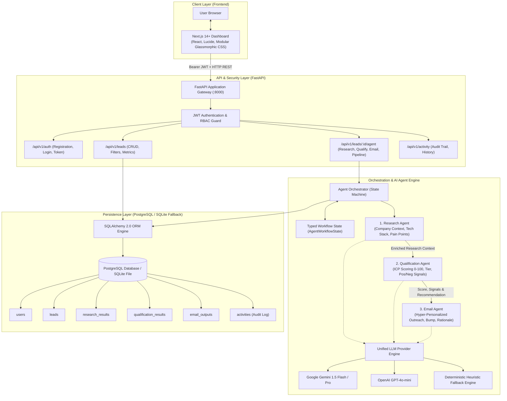
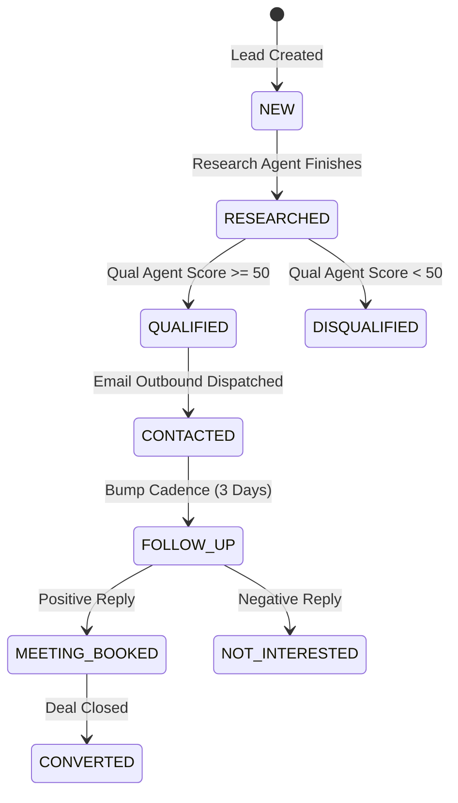

# NEXUS AI SDR — System Architecture & Multi-Agent Design

## 1. High-Level System Architecture

---

## 2. Multi-Agent Data Flow Sequence

```mermaid
sequenceDiagram
    autonumber
    actor SalesRep as Sales Rep / Recruiter
    participant UI as Next.js Dashboard
    participant API as FastAPI Backend
    participant Orch as Agent Orchestrator
    participant State as AgentWorkflowState
    participant R_Agent as 1. Research Agent
    participant Q_Agent as 2. Qualification Agent
    participant E_Agent as 3. Email Agent
    participant DB as Database (PostgreSQL)

    SalesRep->>UI: Clicks "Run Full Multi-Agent Pipeline"
    UI->>API: POST /api/v1/leads/{id}/pipeline
    API->>Orch: execute_pipeline(lead_id)
    Orch->>DB: Load Lead Profile
    Orch->>State: Initialize State (Company, Contact, Role, Industry, Notes)

    rect rgb(20, 35, 60)
        Note over Orch,R_Agent: Step 1: Research Agent Execution
        Orch->>R_Agent: run(state)
        R_Agent->>R_Agent: Inspect website metadata + LLM sales synthesis
        R_Agent-->>State: ResearchResult (Summary, Pain Points, Tech Stack, Growth Signals)
        Orch->>DB: Persist research_results & Log Activity
    end

    rect rgb(30, 50, 40)
        Note over Orch,Q_Agent: Step 2: Qualification Agent Execution
        Orch->>Q_Agent: run(state)
        Q_Agent->>Q_Agent: Evaluate ICP Fit (Role Authority + Industry + Scale + Signals)
        Q_Agent-->>State: QualificationResult (Score: 0-100, HIGH/MED/LOW, Pos/Neg Signals)
        Orch->>DB: Persist qualification_results, Update Lead Status & Log Activity
    end

    rect rgb(50, 30, 60)
        Note over Orch,E_Agent: Step 3: Email Agent Execution
        Orch->>E_Agent: run(state)
        E_Agent->>E_Agent: Synthesize pain points & growth into targeted outreach
        E_Agent-->>State: EmailOutput (Subject, Tailored Body, Follow-up, Rationale)
        Orch->>DB: Persist email_outputs & Log Activity
    end

    Orch-->>API: Return Complete Pipeline State
    API-->>UI: 200 OK (Research + Qualification + Email + Status)
    UI-->>SalesRep: Visual cockpit displays score gauge, signals & send-ready email
```

---

## 3. Ideal Customer Profile (ICP) Scoring Matrix

The Qualification Agent evaluates each prospect against a 4-dimensional objective rubric:

| Dimension | Evaluation Criteria | Max Points |
| :--- | :--- | :---: |
| **Role Authority** | Executive Decision Maker (VP Sales, CRO, CCO, Head of RevOps, Founder) | **30** |
| **Industry Relevance** | B2B SaaS, Cloud Infrastructure, Fintech, Data Analytics Platforms | **30** |
| **Company Scale** | 20 – 500 employees (sweet spot where SDR efficiency yields highest ROI) | **25** |
| **Growth & Buying Signals** | Headcount surges, active SDR hiring, expansion announcements | **15** |

### Tier Thresholds:
- **`HIGH_FIT` (75 – 100)**: Immediate priority outbound sequence with executive tone.
- **`MEDIUM_FIT` (50 – 74)**: Targeted nurture cadence focusing on workflow enablement.
- **`LOW_FIT` (< 50)**: Disqualified or held; low conversion probability (e.g. solopreneurs, non-tech).

---

## 4. Lead Status State Transitions

